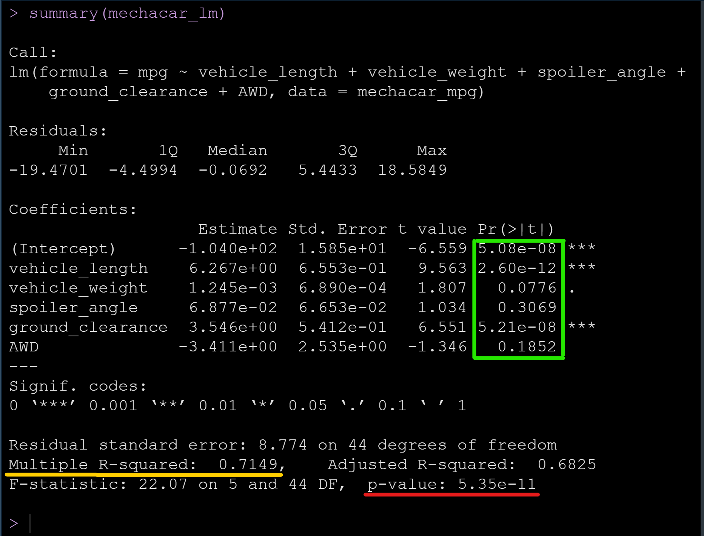
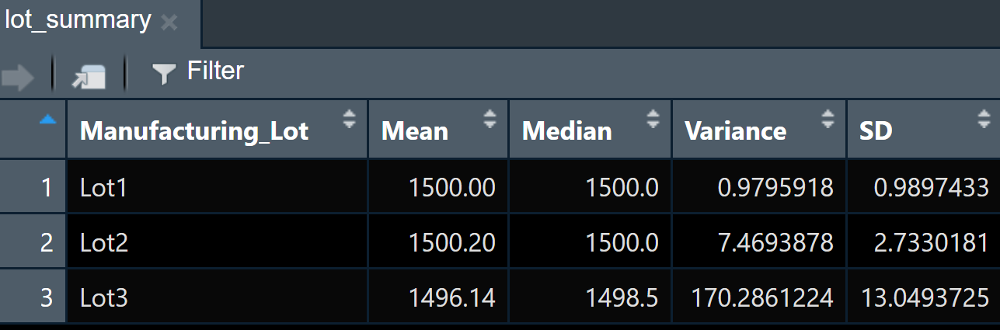
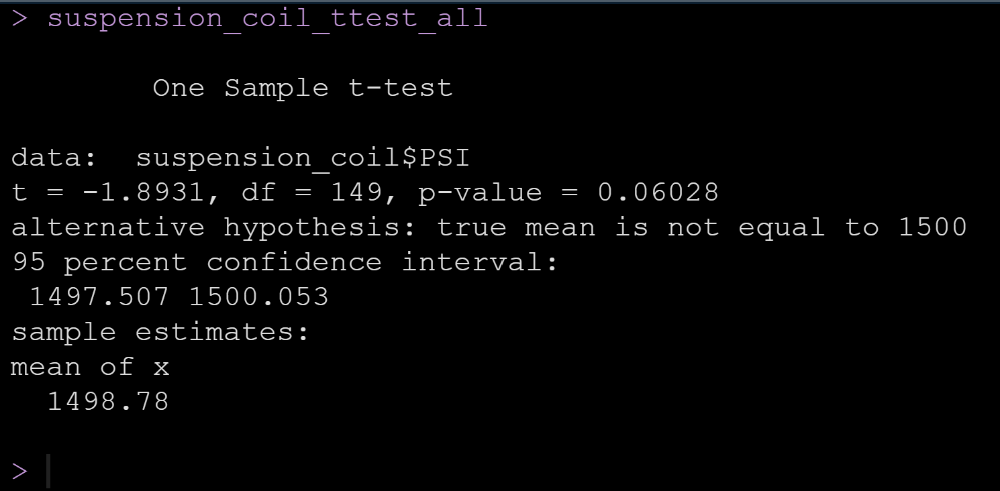
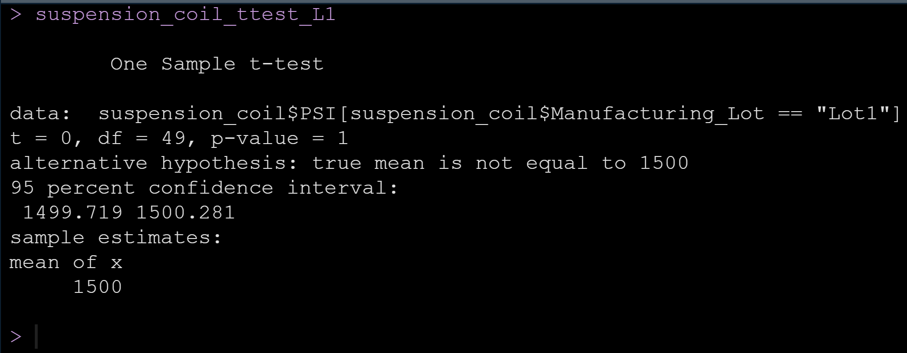
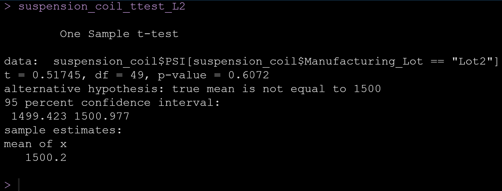
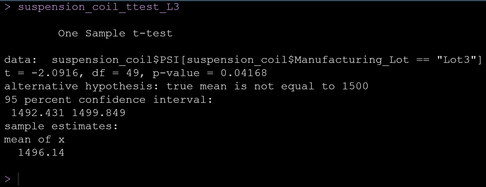

# MechaCar_Statistical_Analysis
Analyze production data for manufacturing insights.

## Linear Regression to Predict MPG
With the given dataset "MechaCar_mpg.csv" presenting for this analysis, 2+ continuous independent variables (namely; vehicle length, vehicle weight, spoiler angle, ground clearance, and drivetrain) and one (1) continuous dependent variable (namely, mpg), a number of questions for a multiple linear regression could be posed and answered utilizing functions coded in R.

The image below shows the RStudio output screen with areas highlighted for the focused description which follows:
||
|---|
||

Upon a review of the green boxed area, of note are the **"vehicle_length" and "ground_clearance"** variables, with corresponding "Pr(>|t|)" column results – being well below a standard significance value (commonly 0.05) – depicting that those variables **provide a non-random amount of variance** to the mpg values in the dataset. This being the case (at least one variable providing a non-random amount of variance to the mpg) allows for the analysis to state that there is **sufficient evidence to reject the null hypothesis(*)** in favor of the alternative one; in other words then, the linear model is considered to have a non-zero slope. This conclusion (rejection of the null hypothesis) receives additional support from the (red-underlined) p-value well below the significance level.

Consideration of two elements of the depicted results can address the question of whether the linear model effectively predicts the mpg of MechaCar prototypes: the yellow-underlined "Multiple R-squared value (0.7149), and the "(Intercept)" at the top in the green box (value 5.08 x 10-8). The R-squared value indicates that more than two thirds (close to 71%) of the variability of the mpg values in the dataset can be predicted by the model, which is **well more effective than the expected results of a coin-toss**. At the same time, **however, there is room to improve the model**, by considering perhaps further variables or by scaling/transforming variables (this would be vehicle_length, and ground_clearance) which were considered. These considerations are indicated both by the "(Intercept)" result having top-level (triple-starred) significance coding, and by the low number (only two of five) variables being indicated as contributing significantly to evidence for rejecting the null hypothesis. Already, though, the model may have been subject to "overfitting" – described (Module 15.7.3) as meaning "a model performs well with a current dataset, but fails to generalize and predict future data correctly."

*
- null hypothesis H0: The slope of the linear model is equal to zero.
- alternative hypothesis Ha: The slope of the linear model is not equal to zero.

## Summary Statistics on Suspension Coils

||
|---|
|[total_summary]: |
|[lot_summary]: |

The variance for the suspension coils for **all lots in total** (see total_summary image), at a value of 62.29 (PSI)^2, **meets the design specification;** and **Lot1 and Lot2** (lot_summary image) **likewise each meet the design specification**. However, as can be viewed in the lot_summary image with a variance value of approximately 170.29 (PSI)^2, **Lot3 individually fails to meet the design specification** that the variance of the suspension coils must not exceed 100 pounds-per-square-inch (squared) — which translates to a standard deviation (SD in the images) of 10 pounds-per-square-inch (SD is found by taking the square root of the variance, so 10 psi is the square-root of 100) — and with SD value 13.05 > 10 this means that Lot3 has a manufacturing issue where there exists too much variation in the manufacturing, not meeting the design specification for suspension coil manufacture.  

## T-Tests on Suspension Coils
For each of the four one-sample t-tests, the following hypotheses were in effect [the abbreviation H0 (Ha) is for the null (alternative) hypothesis]:
- H0 : There is **no statistical difference** between the depicted sample mean and the population mean (1500 PSI).
- Ha : There **is a statistical difference** between the depicted sample mean and the population mean (1500 PSI).

|||
|---|---|
|[T-Test for PSI across all manufacturing lots] A p-value of 0.06 is above the significance level of 0.05 of the test; thus, insufficient evidence exists to reject the null hypothesis. In other words, the null hypothesis (see above) remains in effect for the mean PSI of the sample (all manufacturing lots) versus the population.|[T-Test for PSI for Manufacturing Lot1]  The p-value of 1 means that the mean of the sample (for Manufacturing Lot1) is the same as the mean of the population. In other words, no evidence exists for rejecting the null hypothesis in favor of an alternative one for the sample data.|
||[T-Test for PSI for Manufacturing Lot2] With a p-value approximately 0.61, the value is above the significance level of the test (0.05); thus, there is insufficient evidence to reject the null hypothesis in favor of the alternative one for the sample data from Manufacturing Lot2.|
||[T-Test for PSI for Manufacturing Lot3] The p-value of 0.04 is below the significance level of the test (0.05) and it may thus be stated that sufficient evidence exists in this case (Manufacturing Lot3) to reject the null hypothesis, meaning that there is a statistical difference between the mean of the sample data and that of the population. In other words, sufficient evidence exists that Manufacturing Lot3 has a sample mean that is statistically different from the 1500 PSI mean of the population.|

## Study Design: MechaCar vs Competition
The study design will address the following pertinent issues:

- Test Metrics
  - Highway fuel efficency of vehicles overall and based on car class.
- Null (H0) and alternative (Ha) hypotheses:
  - H0 : There is no difference in average highway fuel efficiency between the MechaCar vehicles and those from other manufacturers.
  - Ha : There is a difference in average highway fuel efficiency between MechaCar vehicles versus those from other manufacturers.
- Hypothesis testing.
  - A statistical test for testing the hypothesis in this study is to be the ANOVA test, chosen (reference Module 15.4.1 — Identifying Statistical Test Types#) as there are multiple independent, categorical variables (e.g., market segment, year, cylinders, weight class, fuel type, transmission) and one dependent continuous variable (highway fuel efficiency).
- Data requirements (these must be checked **prior to** running the statistical test).
  - Dependent variable is : numerical, continuous, normally distributed
  - Independent variables are : categorical
  - Similar variance among each group#

 # Notes from Module 15.6 (Perform an Analysis of Means in R), reference sheet from Challenge (also from Module 15.4.1), and StackOverflow site (https :// stackoverflow.com/questions/60269527/when-to-use-as-numeric-and-as-factor-in-r) : 
> - in Module 15.6.1 - a qualitative assesssment of data normalcy may be performed utilizing R's ggplot2 library with the geom_density() function 

> - in Module 15.6.5 - in ANOVA, may be necessary to convert numerical data in R to a categorical factor (see also StackOverflow site noted above) 

> - Module 15.6.5 - references one-way and two-way ANOVA; with one-way ANOVA being the more fitting for this study, would consider separately each independent variable versus the dependent variable.
